  

  

  

  

   

  

<i>I'm Nimsara, a passionate tech enthusiast and computer science graduate who loves exploring new technologies, learning new things, and turning ideas into meaningful digital experiences.</i>

  

   

<b>STACK</b>

  

   

