 

 

<i>I'm Nimsara, a passionate tech enthusiast and computer science graduate 
who loves exploring new technologies, learning new things, and 
turning ideas into meaningful digital experiences.</i>

 

 

  

